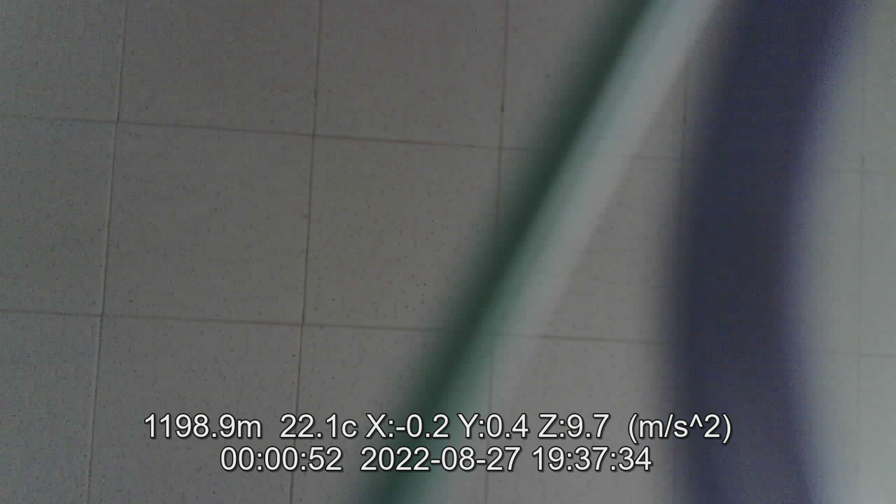
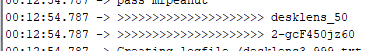

# ESP32-CAM-RocketCam
ESP32-CAM Video Recorder for Rockets with sensors for Altitude, Temperature, Acceleration

This program is a fork of https://github.com/jameszah/ESP32-CAM-Video-Recorder-junior to add BMP180 and an ADXL345 sensor to the ESP32-CAM, that can be used to display the altitude, temperature, and acceleration of a small rocket ... or other stuff.  It is stored as a srt file, which can play with the avi video as a text caption on the screen while you are playing the video.  Or shut it off and just see the video.

The two sensors are attached at sda ESP32-CAM gpio 3 (the RX pin for downloading) and scl at ESP32-CAM gpio 13 (one of the unused SD card pins), plus 3.3v and GND.

ESP32-CAM gpio 12, is still used to suspend the recording -- pull it to ground and the recording will write its index and end, and wait to he be released to start a new video.

This is set up by default to use AP mode, so you do not need a router.  The ESP32 sets up an internet host that you can attach to and look through the viewfinder for pictures or streaming video, and also set the time because the ESP32 cannot connect to the internet to get the time.  The name and password for the AP mode are printed out on the serial monitor -  the password is a hash of mac address and various things, so it is reasonably secure.  Look for these lines - if you change the name of the ESP32 in the config file, the ssid whill change (desklens_50) but password will remain the same.  Look for these lines on the serial output when you first turn on the module.

The recording parameters are set in the config.txt file on the sd card.   See https://github.com/jameszah/ESP32-CAM-Video-Recorder-junior for details.

SourceCode: <a href="https://github.com/jameszah/ESP32-CAM-RocketCam/">https://github.com/jameszah/ESP32-CAM-RocketCam/</a>       
        
     
James Zahary - Aug 28, 2022      
Free coffee <a href="https://ko-fi.com/jameszah">https://ko-fi.com/jameszah/</a>    

